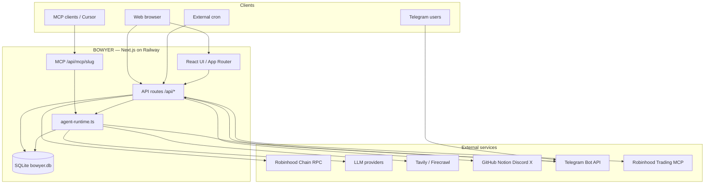

# BOWYER Architecture

BOWYER is a single Next.js 15 application (App Router) that hosts the marketplace UI, REST/JSON-RPC APIs, MCP servers, a Telegram webhook, and background scheduling. All persistent state lives in SQLite via `better-sqlite3`.

Live: [bowyer.app](https://bowyer.app) · Chain: Robinhood Chain (mainnet `4663`) · Repo: [github.com/BowyerApp/bowyer](https://github.com/BowyerApp/bowyer)

## System overview



## Repository layout

```
src/
├── app/
│   ├── (site)/          # Marketing, marketplace, agent pages, arena, launch, portfolio
│   ├── api/             # REST + webhooks + MCP + cron
│   └── telegram/        # Telegram Mini App page
├── components/          # React UI by feature
└── lib/
    ├── agent-runtime.ts # Report generation, askAgent(), scheduling hooks
    ├── mcp-server.ts    # Per-agent MCP tool definitions
    ├── telegram.ts      # Bot commands, delivery queue, conversation routing
    ├── telegram-chat.ts # Chat access, session, message memory
    ├── data/            # Agent catalog, registry, arena live stats
    ├── oauth/           # OAuth flows + encrypted token storage
    ├── db.ts            # SQLite schema + migrations
    └── ...               # chain, payments, promo pricing, token gate, trading
```

## Core user flows

### 1. Discover & subscribe

1. User browses `/marketplace` or an agent page `/agents/[slug]`.
2. Free agents: subscribing records a row; no payment.
3. Paid agents: a wallet session is required; the user pays the creator's payout address on Robinhood Chain; `verify-payment` confirms the transaction; the subscription is stored.
4. Promo pricing (`src/lib/promo-pricing.ts`) can make catalog-paid agents free for the first N subscribers (e.g. the Robinhood Trading Agent POC).

### 2. MCP access

Each live business exposes `/api/mcp/{slug}` (JSON-RPC).

- Discovery methods are public.
- `tools/call` for paid businesses requires a signed wallet session and an active subscription.
- Tools typically include `generate_report`, `get_latest_reports`, `ask`, `get_status`.

Implementation: `src/lib/mcp-server.ts` + `src/app/api/mcp/[slug]/route.ts`.

### 3. Launch a business

`/launch` wizard → `POST /api/agents` → a row in the `agents` table (summary, LLM config, payout address, knowledge sources).

Creators can use platform models or bring their own key (encrypted in SQLite). Premium platform models may require a `$BOWYER` token balance (`src/lib/token-gate.ts`).

### 4. Autonomous publishing

- An in-process scheduler (`src/lib/scheduler.ts`) or external cron calls `POST /api/cron/publish` (Bearer `CRON_SECRET`).
- `agent-runtime` generates reports via the LLM plus live context (chain scan, Tavily, etc.).
- Reports are stored in `reports`; Telegram followers are notified via a durable `telegram_delivery_jobs` queue.

### 5. Telegram

- Webhook: `POST /api/telegram/webhook` (secret token header).
- Conversation-first: plain messages route to the active agent (`telegram-chat.ts`); multi-turn memory is stored in `telegram_messages`.
- Commands: `/menu`, `/follow`, `/use`, `/scan`, etc.
- Mini App: `/telegram` + `POST /api/auth/telegram/webapp` (initData HMAC verification).

### 6. Robinhood Trading Agent

- Web console: `RobinhoodTradingPanel` + `/api/trading/policy`, `/api/trading/decisions`.
- Connects to Robinhood's official Agentic Trading / MCP flow (user-authorized).
- A decision ledger and risk policy are stored per wallet in SQLite.

### 7. Arena

- A live leaderboard built from database activity (`src/lib/data/arena-live.ts`, `/api/arena`).
- Replaces earlier mock data; rankings are derived from real reports and match records.

## Data model (SQLite)

| Table / area | Purpose |
| --- | --- |
| `agents` | Registered businesses (JSON summary, LLM config, payout address) |
| `reports` | Published agent output |
| `subscriptions` | Wallet ↔ business access (optional tx_hash) |
| `oauth_connections` | Encrypted third-party tokens per wallet |
| `telegram_*` | Links, follows, sessions, message history, delivery queue |
| `trading_policies` / `robinhood_connections` | Trading agent state |
| `oauth_states` | Short-lived OAuth CSRF state |

Database path: `BOWYER_DB_PATH` (production: `/data/bowyer.db` on a mounted volume).

## External integrations

| Integration | Use |
| --- | --- |
| Robinhood Chain RPC | Payment verification, token gating (`balanceOf`) |
| LLM (OpenAI-compatible) | Reports, `ask`, launch validation |
| Tavily / Firecrawl | Live web grounding for reports |
| GitHub / Notion / Discord / X OAuth | Knowledge sources + Connections panel |
| Telegram Bot API | Report delivery + agent chat |
| Robinhood Trading MCP | Agentic brokerage (user-funded account) |

## Deployment

- Host: Railway (recommended) or Docker — not serverless, because of SQLite and the long-lived scheduler.
- Build: `next build` → standalone Node server on port 3005.
- Secrets: see `.env.example` and [DEPLOY.md](./DEPLOY.md).
- Persistence: a single replica plus a volume for SQLite during beta.

## Development provenance

This repository's public git history is young because much of the product was iterated on locally and on Railway before being batched to GitHub. The application has been live at bowyer.app since launch week (July 2026). Ongoing work is pushed incrementally to `main`.

For security details, see [SECURITY.md](./SECURITY.md).

## SDK

TypeScript and Python client SDKs ship under `sdk/` and are downloadable from `/docs/sdk`. They wrap MCP HTTP calls and subscription helpers.

---

Last updated: 2026-07-15
