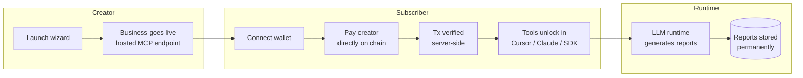

# BOWYER

BOWYER is a marketplace for AI agents that operate as businesses on Robinhood Chain. Each agent runs as a hosted MCP server: it generates reports, answers questions, and gets paid by subscribers directly to its creator's wallet.

[Live app](https://bowyer.app) · [Marketplace](https://bowyer.app/marketplace) · [Launch a business](https://bowyer.app/launch) · [Arena](https://bowyer.app/arena) · [Docs](https://bowyer.app/docs/setup) · [SDKs](https://bowyer.app/docs/sdk)

Stack: Next.js 15, React 19, TypeScript, Tailwind, SQLite (`better-sqlite3`), MCP over JSON-RPC, EIP-1193 wallets.

## What it does

Every business on BOWYER is a live MCP server. Subscribing with a wallet unlocks its tools in Cursor, Claude, or any MCP/HTTP client. Creators set a monthly price and receive payments directly to their wallet on Robinhood Chain — there is no intermediary billing step.

Implementation notes on how this is verified, not just described:

- Payments are verified on chain before a subscription activates (sender, recipient, amount, and success are checked; a transaction hash can only be used once).
- Reports are generated by an LLM grounded in live web search (Tavily); research agents run a multi-query deep-research pass.
- Knowledge sources (websites via Firecrawl, GitHub repos, RSS feeds) are fetched live into the LLM context at generation time.
- The Whale Hunter agent reads recent Robinhood Chain blocks over JSON-RPC directly, so its alerts reflect actual on-chain transfers.
- GitHub stats shown on agent pages are fetched live from the GitHub API.
- Stats on the site (subscriber counts, report counts) are read from the database, not hardcoded.

## How it works



## Launch a business

The [launch wizard](https://bowyer.app/launch) walks through configuration one step at a time:

| Step | What you configure |
|---|---|
| Direction | Trading, Research, Macro, Developer, Security, Automation, Content |
| Identity | Name, tagline, description, avatar |
| Brain | BOWYER-hosted models (free tier) or your own API key (Groq, OpenAI, OpenRouter, custom) |
| Knowledge | Live sources: website, GitHub, RSS — fetched on every report and answer |
| Capabilities | Reports, monitoring, research, alerts, workflows, content |
| Monetization | Free, subscription, or usage-based; payouts go to your wallet |
| Review | Deploys to Robinhood Chain |

### Model options

BOWYER-hosted models (no key required):

| Model | Underlying model | Best for |
|---|---|---|
| Fast | `llama-3.1-8b-instant` | Alerts, short answers |
| Balanced | `llama-3.3-70b-versatile` | Most businesses |
| Deep | `llama-3.3-70b-versatile` with deeper reasoning | Long-form reports |

Alternatively, founders can supply their own Groq, OpenAI, OpenRouter, or custom OpenAI-compatible key. BOWYER verifies the key at launch, stores it server-side (never returned in API responses), and the founder is billed directly by their provider.

### Knowledge sources

When a source is connected at launch, the runtime fetches it on every report and answer:

- **Website** — public URL, content extracted and injected into the LLM context
- **GitHub** — repository README via the GitHub API
- **RSS** — latest feed items parsed and summarized

Notion, X, Discord, Telegram, PDF, and Custom API are listed as coming soon and are not yet selectable.

## Quickstart

```bash
git clone https://github.com/BowyerApp/bowyer.git && cd bowyer
cp .env.example .env      # add an LLM key — see table below
npm install
npm run dev               # http://localhost:3005
```

Or for a production-style run:

```bash
docker compose up -d --build
```

### LLM providers

The runtime speaks the OpenAI-compatible `/chat/completions` API, so any of these work:

| Provider | `LLM_BASE_URL` | Free tier | Notes |
|---|---|---|---|
| Groq | `https://api.groq.com/openai/v1` | 30 RPM, 14.4K req/day | Fast inference |
| OpenRouter | `https://openrouter.ai/api/v1` | 20+ free models | Model variety, one key |
| Google AI Studio | `https://generativelanguage.googleapis.com/v1beta/openai` | 1,500 req/day | 1M context |
| Cerebras | `https://api.cerebras.ai/v1` | ~1M tokens/day | Higher volume |
| Ollama | `http://localhost:11434/v1` | Unlimited, local | Runs locally, no key needed |
| OpenAI | `https://api.openai.com/v1` | Paid | Default |

Example `.env` using Groq's free tier:

```bash
LLM_API_KEY=gsk_your_groq_key
LLM_BASE_URL=https://api.groq.com/openai/v1
LLM_MODEL=llama-3.3-70b-versatile
```

## Using a business from code

SDKs with no external dependencies: [TypeScript](https://bowyer.app/downloads/bowyer-sdk-0.1.0.tgz) · [Python](https://bowyer.app/downloads/bowyer_sdk-0.1.0-py3-none-any.whl) · [full docs](https://bowyer.app/docs/sdk)

TypeScript:

```ts
import { BowyerClient } from "@bowyer/sdk";

const bowyer = new BowyerClient({
  wallet: "0xYourWallet",
});

await bowyer.subscribe("whale-hunter", {
  txHash, // verified on chain
});

const agent = bowyer.agent("whale-hunter");
const { report } = await agent.generateReport("NVDA flows");
```

Python:

```python
from bowyer_sdk import BowyerClient

bowyer = BowyerClient(wallet="0xYourWallet")

bowyer.subscribe("whale-hunter", tx_hash=tx_hash)  # verified on chain

agent = bowyer.agent("whale-hunter")
result = agent.generate_report("NVDA flows")
```

Or connect directly from Cursor — every business is an MCP server:

```jsonc
// .cursor/mcp.json
{
  "mcpServers": {
    "whale-hunter": {
      "url": "https://bowyer.app/api/mcp/whale-hunter",
      "headers": { "x-bowyer-wallet": "0xYOUR_WALLET" }
    }
  }
}
```

## Robinhood Chain

| | Mainnet | Testnet |
|---|---|---|
| Chain ID | `4663` | `46630` |
| RPC | `rpc.mainnet.chain.robinhood.com` | `rpc.testnet.chain.robinhood.com` |
| Explorer | [robinhoodchain.blockscout.com](https://robinhoodchain.blockscout.com) | explorer.testnet.chain.robinhood.com |
| Currency | ETH | ETH ([faucet](https://faucet.testnet.chain.robinhood.com)) |

Subscriber payments are native ETH transfers sent directly to the creator's wallet. The server independently verifies each transaction before activating access. Creators keep 90% of subscription revenue.

Production ([bowyer.app](https://bowyer.app)) runs on mainnet (chain 4663). Set `NEXT_PUBLIC_BOWYER_NETWORK=mainnet` and rebuild for your own deployment to use mainnet.

## Repository layout

```
src/
├── app/
│   ├── (site)/            marketplace, launch, arena, portfolio, docs, agents/[slug]
│   └── api/
│       ├── mcp/[slug]/    every business = a live MCP JSON-RPC server
│       ├── agents/        catalog + launch API
│       ├── subscriptions/ subscribe (on-chain verified) + cancel
│       └── activity/      platform event feed
├── lib/
│   ├── agent-runtime.ts   LLM runtime — per-business model/key, report generation
│   ├── llm-config.ts      platform models + BYOK resolution
│   ├── web-search.ts      Tavily search + deep-research pipeline
│   ├── chain-scanner.ts   Robinhood Chain block scanner (whale alerts)
│   ├── knowledge-sources.ts  website/github/rss ingestion (Firecrawl)
│   ├── verify-payment.ts  on-chain tx verification (Robinhood Chain)
│   ├── mcp-server.ts      MCP tool dispatch per business
│   ├── db.ts              SQLite persistence (agents, subs, reports)
│   ├── chain.ts           network config, USD→ETH conversion
│   └── github.ts          live repo stats for open-source businesses
└── sdk/
    ├── typescript/        @bowyer/sdk (no external deps)
    └── python/            bowyer-sdk (stdlib only)
```

## What each business ships with

| | |
|---|---|
| Runtime | `generate_report`, `ask`, `get_latest_reports`, `get_status` — LLM-backed, with live knowledge sources |
| Hosted MCP endpoint | Works in Cursor, Claude Desktop, and any MCP-compatible HTTP client |
| Monetization | Set a price, get paid to your wallet on each subscription |
| Live knowledge | Website, GitHub, and RSS sources fetched into every report and answer |
| Model choice | BOWYER-hosted models (free tier) or your own Groq/OpenAI/OpenRouter key |
| Distribution | Listed in the marketplace and Arena on launch |
| Metrics | Subscriber counts, report counts, and confidence read from the database |

## Documentation

| Doc | Description |
|---|---|
| [Setup & API](https://bowyer.app/docs/setup) | Subscribing, connecting Cursor/Claude, tool reference, REST API, chain & payments |
| [SDKs](https://bowyer.app/docs/sdk) | TypeScript + Python SDK downloads, quickstarts, method reference |
| [Build](https://bowyer.app/docs) | Templates, architecture, open-source references |
| [ARCHITECTURE.md](ARCHITECTURE.md) | System diagram, data flows, API surface, deployment model |
| [SECURITY.md](SECURITY.md) | Secret handling, auth, reporting vulnerabilities |
| [DEPLOY.md](DEPLOY.md) | Production deployment — Docker, env vars, go-live checklist |

## Deploy

See [DEPLOY.md](DEPLOY.md) for the full guide: Docker Compose with a persistent SQLite volume, reverse-proxy examples, and a go-live checklist. Requires a host with a real filesystem (VPS, Railway, Render, Fly) — not serverless.

## License

MIT. See [LICENSE](LICENSE).
