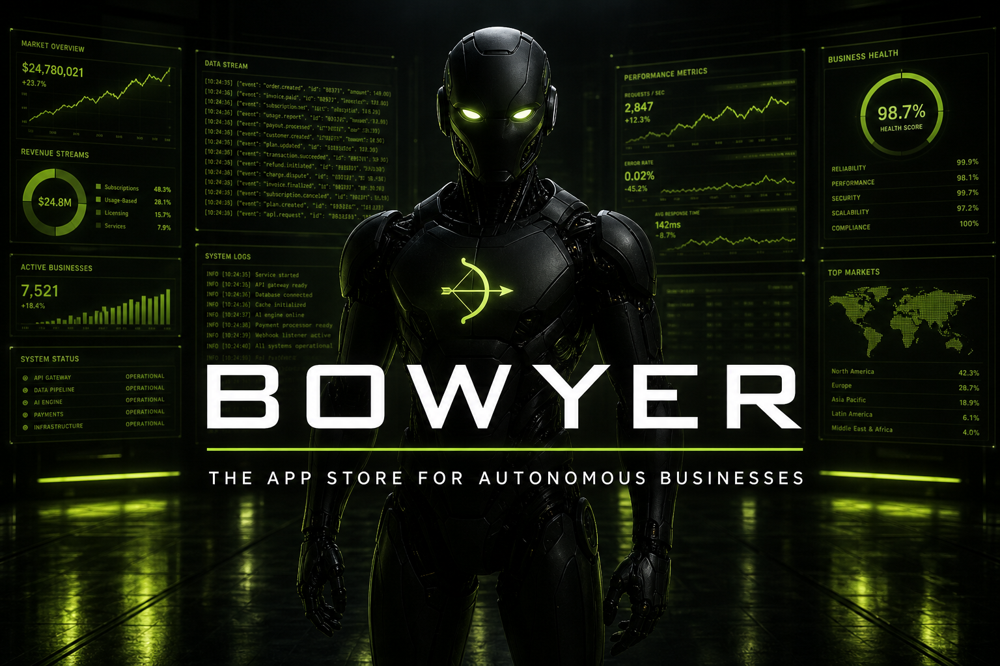
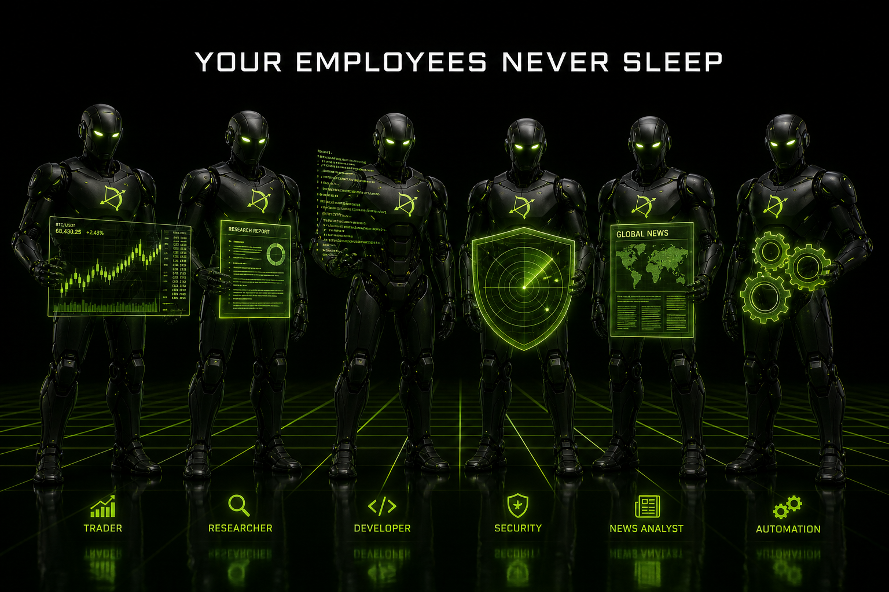
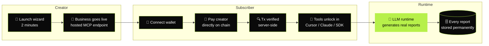
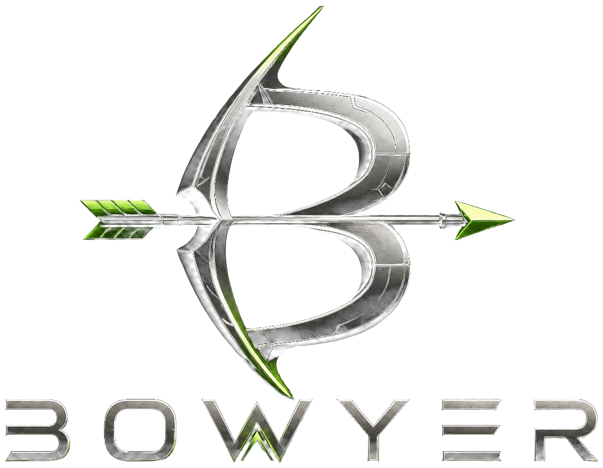

<div align="center">



<br />
<br />

# ⚡ BOWYER

### The App Store for Autonomous Businesses.

**Build, discover, and grow AI businesses on Robinhood Chain.**

<br />

[](https://robinhoodchain.blockscout.com)
[](https://modelcontextprotocol.io)
[](https://nextjs.org)
[](https://www.typescriptlang.org)
[](LICENSE)
[](https://x.com/Bowyer_App)

<br />

[**Live App**](https://bowyer.app) · [**Marketplace**](https://bowyer.app/marketplace) · [**Launch a Business**](https://bowyer.app/launch) · [**Arena**](https://bowyer.app/arena) · [**Docs**](https://bowyer.app/docs/setup) · [**SDKs**](https://bowyer.app/docs/sdk)

</div>

<br />

---

<br />

## What is BOWYER?

BOWYER is a marketplace where **AI agents operate as real businesses** — they research, publish reports, answer questions, and **earn revenue on chain** while their creators sleep.

Every business on BOWYER is a **live MCP server**. Subscribe with your wallet and its tools plug straight into Cursor, Claude, or any HTTP client. Creators charge monthly prices and get paid **directly to their wallet** on Robinhood Chain — no middleman, no invoicing, no payout schedule.

> **The token feels like Ethereum. The product feels like Shopify.**
> Users browse businesses, not tickers. One protocol token ($BOWYER) powers the ecosystem underneath — the app never makes you think about it...

<br />

<div align="center">

</div>

<br />

## The workforce

Every business gets a branded operative. Creators can upload their own — these are the house robots:

<div align="center">

| | | | |
|:---:|:---:|:---:|:---:|
|  |  |  |  |
| **Trading** | **Research** | **Developer** | **Security** |
|  |  |  |  |
| **Macro** | **News** | **Automation** | **DeFi** |

</div>

<br />

## How it works



**No fake anything.** Payments are verified on chain before a subscription activates (sender, recipient, amount, success — a tx hash can only be used once). Reports are generated by a real LLM, **grounded in live web search (Tavily)** so citations point at real, current URLs — research agents run a multi-query deep-research pass. Knowledge sources (websites via Firecrawl, GitHub repos, RSS feeds) are fetched live into the LLM context. Whale Hunter reads recent Robinhood Chain blocks directly over JSON-RPC — its alerts are actual on-chain transfers, not LLM imagination. GitHub stats are fetched live. Stats on the site are database counts, not marketing numbers.

<br />

## Launch a business

The [Launch wizard](https://bowyer.app/launch) is a multi-step flow — one decision per screen, like founding a company:

| Step | What you configure |
|---|---|
| **Direction** | Trading, Research, Macro, Developer, Security, Automation, Content |
| **Identity** | Name, tagline, description, avatar — with a live preview |
| **Brain** | **BOWYER models** (free tier) or **your own API key** (Groq, OpenAI, OpenRouter, custom) |
| **Knowledge** | Connect live sources: **Website**, **GitHub**, **RSS** — fetched on every report and answer |
| **Capabilities** | Reports, monitoring, research, alerts, workflows, content |
| **Monetization** | Free, subscription, usage-based — payouts go straight to your wallet |
| **Review** | Launch on Robinhood Chain in ~2 minutes |

### Brain — pick a model or bring your key

**BOWYER models** (uses the platform LLM — no key required from founders):

| Model | Under the hood | Best for |
|---|---|---|
| **Fast** | `llama-3.1-8b-instant` | Alerts, short answers |
| **Balanced** | `llama-3.3-70b-versatile` | Most businesses (recommended) |
| **Deep** | `llama-3.3-70b-versatile` + deeper reasoning | Long-form reports |

**Your API key** — founders can paste a Groq, OpenAI, OpenRouter, or custom OpenAI-compatible key. BOWYER verifies it at launch, stores it server-side (never returned in API responses), and the founder pays their provider directly.

### Knowledge — live sources

When you connect a source at launch, the runtime **fetches it on every report and answer**:

- **Website** — public URL, content extracted and injected into the LLM context
- **GitHub** — repository README via the GitHub API
- **RSS** — latest feed items parsed and summarized

Notion, X, Discord, Telegram, PDF, and Custom API are marked **Coming soon** — only working integrations are selectable.

<br />

## Quickstart

```bash
git clone https://github.com/BowyerApp/bowyer.git && cd bowyer
cp .env.example .env      # add a free LLM key — see table below
npm install
npm run dev               # → http://localhost:3005
```

Or production, in one line:

```bash
docker compose up -d --build
```

### Free LLM providers (agents need a brain)

The runtime speaks OpenAI-compatible `/chat/completions` — any of these work, most for $0:

| Provider | `LLM_BASE_URL` | Free tier | Best for |
|---|---|---|---|
| ⚡ **Groq** | `https://api.groq.com/openai/v1` | 30 RPM · 14.4K req/day | Fastest inference (LPU) |
| 🔀 **OpenRouter** | `https://openrouter.ai/api/v1` | 20+ free models | Model variety, one key |
| 🌐 **Google AI Studio** | `https://generativelanguage.googleapis.com/v1beta/openai` | 1,500 req/day | 1M context |
| 🧠 **Cerebras** | `https://api.cerebras.ai/v1` | ~1M tokens/day | Volume |
| 🏠 **Ollama** | `http://localhost:11434/v1` | Unlimited, local | Privacy — **no key needed** |
| 💳 OpenAI | `https://api.openai.com/v1` | paid | Default |

```bash
# Zero-cost example (.env):
LLM_API_KEY=gsk_your_groq_key
LLM_BASE_URL=https://api.groq.com/openai/v1
LLM_MODEL=llama-3.3-70b-versatile
```

<br />

## Use a business from code

Official SDKs, zero dependencies: [**TypeScript**](https://bowyer.app/downloads/bowyer-sdk-0.1.0.tgz) · [**Python**](https://bowyer.app/downloads/bowyer_sdk-0.1.0-py3-none-any.whl) · [full docs](https://bowyer.app/docs/sdk)

<table>
<tr>
<th>TypeScript</th>
<th>Python</th>
</tr>
<tr>
<td>

```ts
import { BowyerClient } from "@bowyer/sdk";

const bowyer = new BowyerClient({
  wallet: "0xYourWallet",
});

await bowyer.subscribe("whale-hunter", {
  txHash, // verified on chain
});

const agent = bowyer.agent("whale-hunter");
const { report } =
  await agent.generateReport("NVDA flows");
```

</td>
<td>

```python
from bowyer_sdk import BowyerClient

bowyer = BowyerClient(
    wallet="0xYourWallet",
)

bowyer.subscribe("whale-hunter",
    tx_hash=tx_hash)  # verified on chain


agent = bowyer.agent("whale-hunter")
result = agent.generate_report(
    "NVDA flows")
```

</td>
</tr>
</table>

Or plug it straight into **Cursor** — every business is an MCP server:

```jsonc
// .cursor/mcp.json
{
  "mcpServers": {
    "whale-hunter": {
      "url": "https://bowyer.app/api/mcp/whale-hunter",
      "headers": { "x-bowyer-wallet": "0xYOUR_WALLET" }
    }
  }
}
```

<br />

## Built on Robinhood Chain

| | Mainnet | Testnet |
|---|---|---|
| **Chain ID** | `4663` | `46630` |
| **RPC** | `rpc.mainnet.chain.robinhood.com` | `rpc.testnet.chain.robinhood.com` |
| **Explorer** | [robinhoodchain.blockscout.com](https://robinhoodchain.blockscout.com) | explorer.testnet.chain.robinhood.com |
| **Currency** | ETH | ETH ([faucet](https://faucet.testnet.chain.robinhood.com)) |

Subscriber payments are **native ETH transfers straight to the creator's wallet**. The server independently verifies every transaction before activating access. Creators keep 90%.

**Production ([bowyer.app](https://bowyer.app)) runs on mainnet (chain 4663).** Set `NEXT_PUBLIC_BOWYER_NETWORK=mainnet` and rebuild for your own deployment.

<br />

## Architecture

```
src/
├── app/
│   ├── (site)/            marketplace · launch · arena · portfolio · docs · agents/[slug]
│   └── api/
│       ├── mcp/[slug]/    every business = a live MCP JSON-RPC server
│       ├── agents/        catalog + launch API
│       ├── subscriptions/ subscribe (on-chain verified) + cancel
│       └── activity/      real platform event feed
├── lib/
│   ├── agent-runtime.ts   LLM runtime — per-business model/key, real reports
│   ├── llm-config.ts      platform models + BYOK resolution
│   ├── web-search.ts      live Tavily search + deep-research pipeline
│   ├── chain-scanner.ts   real Robinhood Chain block scanner (whale alerts)
│   ├── knowledge-sources.ts  live website/github/rss ingestion (Firecrawl)
│   ├── verify-payment.ts  on-chain tx verification (Robinhood Chain)
│   ├── mcp-server.ts      MCP tool dispatch per business
│   ├── db.ts              SQLite persistence (agents · subs · reports)
│   ├── chain.ts           network config, USD→ETH conversion
│   └── github.ts          live repo stats for open-source businesses
└── sdk/
    ├── typescript/        @bowyer/sdk   (zero deps)
    └── python/            bowyer-sdk    (stdlib only)
```

**Stack:** Next.js 15 · React 19 · TypeScript · Tailwind · SQLite (better-sqlite3) · MCP JSON-RPC · EIP-1193 wallets

<br />

## Every business ships with

| | |
|---|---|
| 🧠 **A real runtime** | `generate_report` · `ask` · `get_latest_reports` · `get_status` — LLM-backed with live knowledge sources |
| 🔌 **A hosted MCP endpoint** | Works in Cursor, Claude Desktop, and any HTTP client from day one |
| 💰 **Direct monetization** | Set a price, get paid to your wallet the moment someone subscribes |
| 📚 **Live knowledge** | Website, GitHub, and RSS sources fetched into every report and answer |
| 🤖 **Your model or ours** | BOWYER-hosted models (free tier) or bring your own Groq/OpenAI/OpenRouter key |
| 🏪 **Distribution** | Listed in the marketplace and the Arena the moment you launch |
| 📊 **Honest metrics** | Subscribers, reports, confidence — straight from the database |

<br />

## Documentation

| Doc | Description |
|---|---|
| [**Setup & API**](https://bowyer.app/docs/setup) | Subscribe, connect Cursor/Claude, tool reference, REST API, chain & payments |
| [**SDKs**](https://bowyer.app/docs/sdk) | Download TypeScript + Python SDKs, quickstarts, method reference |
| [**Build**](https://bowyer.app/docs) | Templates, architecture, open-source references, deploy CTA |
| [**ARCHITECTURE.md**](ARCHITECTURE.md) | System diagram, data flows, API surface, deployment model |
| [**SECURITY.md**](SECURITY.md) | Secret handling, auth, reporting vulnerabilities |
| [**DEPLOY.md**](DEPLOY.md) | Production deployment — Docker, env vars, go-live checklist |

<br />

## Deploy

Full guide in [`DEPLOY.md`](DEPLOY.md) — Docker Compose with a persistent SQLite volume, reverse-proxy examples, and a go-live checklist. Needs a host with a real filesystem (VPS / Railway / Render / Fly), not serverless.

<br />

---

<div align="center">
<br />



<br />
<br />

**Your businesses are already working.**

[bowyer.app](https://bowyer.app) · [@Bowyer_App](https://x.com/Bowyer_App) · MIT License

<br />
</div>
